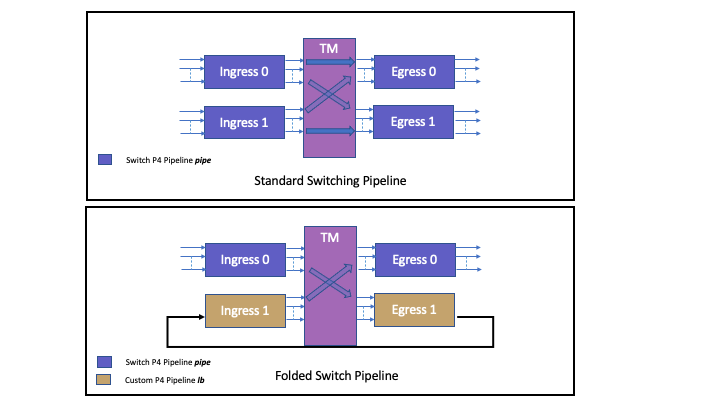
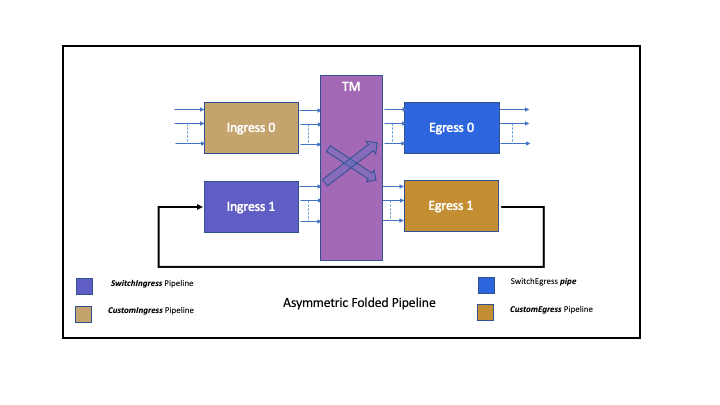
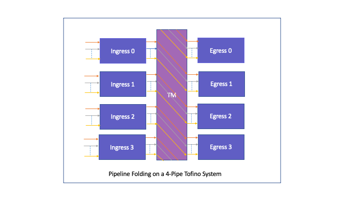
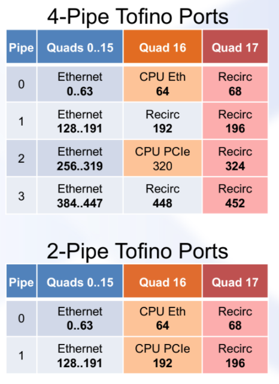
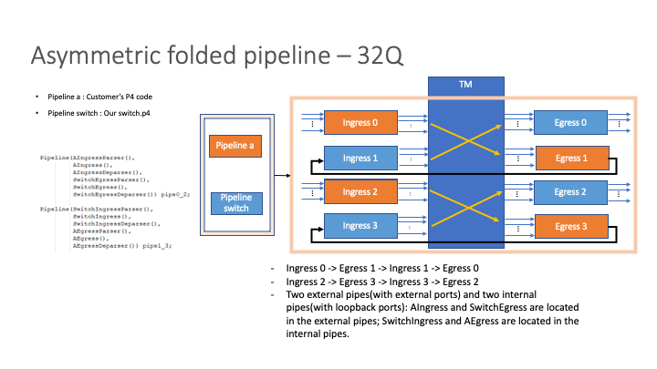
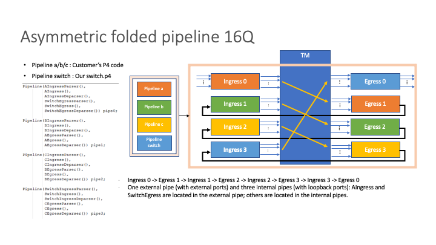
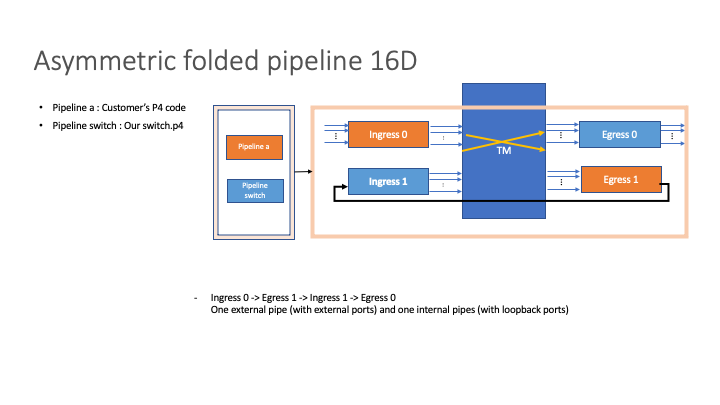

Asymmetric Folded Pipeline
==========================

*   [Overview](#overview)
    *   [Standard Switch Pipeline](#switchPipeline)
    *   [Folded Switch Pipeline](#foldedPipeline)
    *   [Folded Switch Pipeline Usecase](#foldeduse)
    *   [Asymmetric Folded Pipeline](#asymFoldedPipe)
*   [AFP High Level Design](#hld)
    *   [Pipeline Folding](#folding)
    *   [Internal Port Loopback](#loopback)
    *   [Special Case for CPU Ports](#cpuports)
    *   [Switch Pipeline Pipe Identification](#pipelineidentify)
    *   [Switch Ingress Parser Modification](#switchingparser)
    *   [Switch Fixed Components Programming](#fixed)
*   [Implementation](#implementation)
    *   [P4 Profiles](#p4profile)
    *   [Parser Modification](#modparser)
    *   [Pipeline Folding Table](#fold)
    *   [Auto Pipeline Name Inference for Switch Pipeline Tables](#pipenameinf)
    *   [CPU Port Forwarding](#cpufold)
    *   [Port and Pipe Translations](#translation)
*   [Supported SKUs](#supportedskus)

<h2 id="overview">Overview</h2>

<h3 id="switchPipeline">Standard Switch Pipeline</h3>

Barefoot switching ASICs generally have multiple physical ASIC pipelines. Each physical pipeline consists of hardware
resources such as TCAMs, SRAMs, meters, counters, ALUs etc. These hardware resources are all local to the physical pipe
to which they belong. When a P4 program is loaded on to the ASIC, each of these resources gets configured by the
Barefoot driver to perform a dedicated task, say a MAC lookup, packet drop, packet forward etc. A single physical pipe
can be seen to consist of two logically separate components.
1. An Ingress Pipeline
2. An Egress Pipeline

These two pipelines are separated by a TM block, which is where the packets reside until they are scheduled to go out of
a specific port. In essence, the Egress Pipeline consists of all the tables that are executed post the decision of
packet forwarding has been made. While the Ingress Pipeline is the one that does the packet processing, to decide where
the packet should be sent.
A standard switching pipeline is then defined as a pipeline in which packets in the ASIC generally follow the flow

    Port Ingress ---> Ingress Pipeline---> TM Buffers ---> Egress Pipeline ---> Port Egress

In addition, a standard switching pipeline generally consists of a single P4 pipeline definition.
For example,

```cpp

Pipeline(SwitchIngressParser(),
        SwitchIngress(),
        SwitchIngressDeparser(),
        SwitchEgressParser(),
        SwitchEgress(),
        SwitchEgressDeparser()) pipe;

Switch(pipe) main;

```

The above definition defines the complete flow of packet in a _P4 Pipeline_ called as _pipe_. Also, it declares the _switch_
instance _main_ to consist of only a single _P4 Pipeline_, _pipe_,

    SwitchIngressParser ---> SwitchIngress ---> SwitchIngressDeparser ---> SwitchEgressParser ---> SwitchEgress ---> SwitchEgressDeparser

The above P4 Pipeline definition is then common for all physical pipes on the ASIC. This information (which P4 Pipeline
runs on which physical pipe) is conveyed in the Barefoot SDE via the switch conf file as shown below.

```json
...
    "p4_programs": [
        {
            "p4_pipelines": [
                {
                    "p4_pipeline_name": "pipe",
                    ...
                    "pipe_scope": [0, 1, 2, 3]    ---> Pipeline pipe on pipes 0, 1, 2 and 3
                }
            ],
            "program-name": "switch",
...
```

<h3 id="foldedPipeline">Folded Switch Pipeline</h3>

Barefoot SDE comes with a number of switch P4 programs all of which implement basic switching functionalities such as
L2/L3 forwarding, ACLs, Mirroring etc. Most of these programs are resource intensive and leave little room for
implementation of custom features. The standard pipeline takes almost 100% of the MAU resources and it's difficult to fit
in more features until some compromise is made in scale. The reason folded pipeline is helpful because it gives users
more stages to work with and also huge table scale. A folded pipeline trades a bunch of front panel ports, additional
switching latency and bandwidth for extra switch pipeline processing stages. In this scheme only a select few pipes are
configured to run the switch P4 program pipeline that contains the standard switching/routing functionality. While the
remaining pipes can be configured to run/implement a feature that is not part of the standard switching pipeline.
The number of available pipes/stages in the folded pipeline for implementing these non-switch pipeline features
depends on the number of physical pipes available on the target systems as well as on the way the pipeline is defined
and configured.
Barefoot SDE already supports this folded pipeline scheme. An example illustrating this scheme is the
switch_tofino_x3.p4 profile. The P4 pipeline definition for Folded Pipeline looks somewhat similar to the definition
shown below.

```cpp
Pipeline(L4LBIngressParser(),
         L4LBIngress(),
         L4LBIngressDeparser(),
         L4LBEgressParser(),
         L4LBEgress(),
         L4LBEgressDeparser()) lb;


Pipeline(SwitchIngressParser(),
         SwitchIngress(),
         SwitchIngressDeparser(),
         SwitchEgressParser(),
         SwitchEgress(),
         SwitchEgressDeparser()) pipe;

Switch(pipe, lb) main;
```

Note that the above code snippet consists of two P4 pipeline definitions _lb_ and _pipe_ and the single switch instance
_main_ consists of both these pipelines.
The physical ASIC pipes can then be configured with these two P4 pipelines with the help of the conf file as show below

```json
...
    "p4_programs": [
        {
            "p4_pipelines": [
                {
                    "p4_pipeline_name": "pipe",
                    ...
                    "pipe_scope": [0, 1]    ---> Pipeline pipe on pipes 0 and 1
                }
            ],
            "p4_pipelines": [
                {
                    "p4_pipeline_name": "lb",
                    ...
                    "pipe_scope": [2, 3]    ---> Pipeline lb on pipes 2 and 3
                }
            ],
            "program-name": "switch",
...
```
Here  ports on pipes 0 and 1 are the physical front panel ports that are exposed to the user/control plane.

A packet coming in on any one of these ports will have the following packet path.

    SwitchIngressParser ---> SwitchIngress ---> SwitchIngressDeparser ---> L4LBIngressParser ---> L4LBIngress --->
    L4LBIngressDeparser ---> L4LBEgressParser ---> L4LBEgress ---> L4LBEgressDeparser ---> SwitchEgressParser --->
    SwitchEgress -->SwitchEgressDeparser

Note that the packet here enters through _pipe 0_ which is configured to run the Switch Ingress pipeline. Form this pipe
it is sent to _pipe 2 or pipe 3_ by some forwarding decision in _pipe 0_ . Here the custome L4LB Egress pipeline
processes the packets and sends it over the L4LB Ingress Pipeline (also in _pipe 2_ or _pipe 3_). The packets are then
forwarded from this pipe to _pipe 0_ or _pipe 1_ for egress packet processing by the Switch Egress pipeline before it is
finally sent out of the egress port.



<h3 id="foldeduse">Folded Switch Pipeline Usecase</h3>

As explained in the previous section, folded pipeline scheme allows users to extend the standard switch pipeline with
custom features. As per the design, the new feature that are added are executed after the standard switch packet
processing is done. This is because the custom P4 Pipeline is configured on the internal pipes, whereas the packets
enter the ASIC on the external pipes via the standard P4 switch pipeline. This design is well suited for use cases where
packet processing needs to be done post the standard L2/L3/ACL/QoS switching decisions. However, one can imagine a
similar use case where the custom P4 processing is done before the standard switch pipeline processing. This new use
case is addressed by a new Folded Pipeline Mode, called the Asymmetric Folded Pipeline (AFP).

<h3 id="asymFoldedPipe">Asymmetric Folded Pipeline</h3>

The Asymmetric Folded Pipeline (AFP) addresses a new Pipeline Folding scheme in which the custom P4 Pipeline processing
needs to happen before the standard L2/L3 switch pipeline processing. In case of AFP the packets enter the switch via
front panel ports on a custom P4 pipeline. These packets can then traverse through 0 or more custom P4 pipeline stages,
before finally reaching the pipeline that does the Switch Ingress Pipeline processing. From here the packets are sent to
the Switch Egress Pipeline and finally out via the front panel ports. An example configuration of a Tofino 64Q system as
an AFP is shown in the figure below.

In general, for AFP the pipeline layout is as follows

    CustomIngress ---> CustomEgress ---> SwitchIngress ---> SwitchEgress

Here SwitchEgress is in the external pipe, SwitchIngress and CustomEgress are in the internal pipe, while CustomIngress
is present in External pipe and optionally in internal pipes as well.



The three basic requirements from Barefoot SDE for AFP support are:
1. Allow packet modifications before standard Switch pipeline processing.
2. No visible change to the control plane running on top of the Switch pipeline processing, except the reduction in
   number of front panel ports.
3. Intrinsic support for AFP i.e., no custom code modifications should be needed to s3 infra or any other part of the code
   including the switch p4 pipeline to support the new feature, other than code needed for enabling AFP.

<h2 id="hld">AFP HLD</h2>

AFP is realized by means of Pipeline Concatenation. As explained in the above sections Barefoot ASIC can have multiple
physical pipes, each of which can be configured with a P4 pipeline. Under normal circumstances packets ingress on one
of the physical pipes via a front panel port/cpu port and egresses via one or more egress pipes through an egress port.
Thus, only a single P4 pipeline execution happens for a packet under normal circumstances. For AFP, however, the idea is
to have packet undergo more than one P4 Pipeline execution, where in one of the Pipeline that gets executed is the
standard Switching Pipeline. To realize this the various physical pipes and P4 pipelines need to be concatenated in a
serial fashion. This is achieved by a two-step process
1. Pipeline Folding
2. Internal Port Loopback

In an asymmetric folded pipeline only the ports in the pipe containing the SwitchEgress P4 Pipeline are treated as
external ports. Rest of the ports in all the other internal pipes are internal to the Switch.

<h3 id="folding">Pipeline Folding</h3>

Pipeline folding is a mechanism that allows for packets to be forwarded from one of the non-Switch Ingress pipelines to
one of the non-Switch Egress Pipelines. This solves half of the problem of pipeline concatenation, as packets can be
forwarding via this folding mechanism from one physical pipe to another. Although the folding scheme can be arbitrary i.e.
packet on _port x_ on _pipe A_ can be forwarded to _port y_ on _pipe B_, a more consistent folding scheme is used. More
specifically, the AFP design in Barefoot SDE implements the following folding scheme.

    Packet In: _port x_ on _pipe A_     Packet Out: _port x_ on _pipe A+1_

This 1:1 mapping ensure that no backpressure is created due to pipeline folding itself. On a 4-pipe system the folding
scheme ensures that the egress pipe id is within range (0,3) and on a 2-pipe system within (0,1). Besides this special folding
scheme needs to be followed for CPU Port. Specifically, we fold the cpu port on to the recirc port in the consequent
pipe. This would be explained in detail in a later [section](#cpuports).

On a 4-pipe Tofino system the pipeline folding scheme can be visualized with the help of the below diagram.



In the above diagram we assume that _pipe 0_ contains the SwitchEgress pipeline and rest all of the pipes are internal.
Thus the external ports are all of the ports in _pipe 0_. The packets entering on, port x in _pipe 0_ are forwarded to
port x in _pipe 1_ by pipeline folding, port x in _pipe 1_ are forwarded to port x in _pipe 2_ and so on.

<h3 id="folding">Internal Port Loopback</h3>

While Pipeline Folding mechanism explained above gets packet to move across physical pipes, the packets still can not
traverse across more than two physical pipelines. Once the packet reaches an egress pipeline, the packet is destined to
be sent out of the egress port. This is where the internal pipe ports come into picture. The internal pipe ports are all
configured in loopback mode. As a result, any packet that egresses on port x in _pipe A_, ingresses back again on port x
in _pipe A_. In this ingress pipeline, the above Pipeline Folding scheme ensure that the packet is transmitted on to the
next physical pipe.
Below diagram illustrates how Pipeline Folding along with Internal Port Loopback together help concatenate a di-gress
(Ingress + Egress) 4-Parallel Pipeline switch into a di-gress (Ingress + Egress) 4-Serial Pipeline switch. This serial
instead of parallel pipeline layout enables addition of new features to the additional pipelines available.


Internal ports are managed by the SDE internally and are added and configured in loopback mode when the corresponding
front panel ports are added in external pipe. For example, for a 4-pipe 16Q system running Custom Egress pipeline in
_pipe 0_, external ports are present in pipe 0. While the rest of the physical pipes 1, 2 and 3 are all internal. Also,
since the packets traverse the Custom P4 pipelines before they finally reach SwitchIngress processing, we can say that
Switch Ingress pipeline is present in _pipe 3_. Here, the SDE takes care of adding internal loopback ports on pipe 1, 2,
and 3. Instead if we had a 32Q system, with Custom Egress on _pipe 0_ and _pipe 2_, the SDE adds ports in _pipe 1_ and
_pipe 3_ in loopback mode.

<h3 id="cpuports">Special Case for CPU Ports</h3>

Unlike standard front panel ports, CPU port view is not symmetric across all pipes. For example, there would be a first front
panel port on all pipes on the system. But a CPU port is specific to a certain pipe. Some Tofino systems may have
more than one CPU ports, although only one CPU port is generally used. Also, Operation to set CPU port in loopback mode is
not supported. Below image shows the Port layout on 4 and 2 pipe Tofino system.



From the above image, port 64 which corresponds to the CPU port can either be a recirc port, Eth CPU Port or PCIe port
on a pipe. Neither the Eth CPU Port nor the PCIe CPU port support port loopback. Hence while concatenating pipelines
special care needs to be taken for cpu ports. In the AFP design we remedy this problem by folding CPU ports on to recirc
ports, which takes care of pipe concatenation as well as port loopback implicitly.

<h3 id="pipelineidentify">Switch Pipeline Pipe Identification</h3>

As explained earlier, AFP design, allows for running custom switch P4 pipelines in combination with the standard P4
switching pipeline. To be able to do so, it is necessary for the SDE and specifically BMAI to identify on what
pipe-gress which P4 Pipeline (or part of P4 pipeline) is being run. In the old design it was assumed that the standard
switching pipeline is called as pipe. This pipeline _pipe_ would identify both the Ingress and Egress switching
Pipelines. The information binding the ASIC pipeline with the P4 pipeline would then be conveyed by the switch conf
file, a snippet of which is shown below

```json
...
    "p4_programs": [
        {
            "p4_pipelines": [
                {
                    "p4_pipeline_name": "pipe",
                    ...
                    "pipe_scope": [0, 1, 2, 3]    ---> Pipeline pipe on pipes 0, 1, 2 and 3
                }
            ],
            "program-name": "switch",
...
```

As can be seen from the above snippet, the p4 pipeline pipe is configured on all 4-pipes, in both ingress and egress.
However, for AFP, the switch P4 pipeline is a hybrid pipeline. Unlike the _pipe_ pipeline which contains all the
standard switching functions supported out of the box by the SDE, the AFP pipeline can consist of two different parts.
An ingress P4 pipeline part and an Egress P4 pipeline part. One of these components can be the from the _pipe_ pipeline
while the other from a custom P4 Pipeline. To help BMAI code identify what P4 Pipeline program is being run on what
pipe-gress a new pipeline naming scheme is used. The P4 pipeline name is required to be now defined by defined as per
the below naming scheme
   * Pipeline name _pipe_ is reserved for the switch.p4 pipeline programs.
   * Any custom pipeline that extends or appends switch.p4 pipeline _pipe_ must use a name other than pipe. (E.g., _pipe_
     on Pipe 0 and Pipe 3; _custom_ on Pipe 1 and Pipe 4)
   * An Ingress + Egress processing pipeline is generally viewed and treated as single p4 pipeline. In such cases the
     above naming conventions must be followed for any custom p4 pipelines.
   * For the case where the pipeline is logically split into two separate pipelines - an Ingress P4 Pipeline + Egress P4
     Pipeline. It is required that the pipeline name follows the naming format <name_in>_<name_eg>. The below
     conventions apply for this case.
     1. name_in/name_eg should be named as _pipe_ if the respective ingress/egress pipeline runs a part of the switch.p4
        _pipe_ pipeline
     2. for custom p4 code and ingress/egress pipeline any other valid name can be used.
        For example:
        * custom_pipe - A pipeline running _custom_ pipeline on ingress and switch.p4 _pipe_ pipeline on the egress.
        * pipe_custom - A pipeline running _custom_ pipeline on egress and switch.p4 _pipe_ pipeline on the ingress.

A snippet of P4 Pipeline definition for AFP is shown below,

```cpp
Pipeline(CustomIngressParser(),
         CustomIngress(),
         CustomIngressDeparser(),
         SwitchEgressParser(),
         SwitchEgress(),
         SwitchEgressDeparser()) custom_pipe;


Pipeline(SwitchIngressParser(),
         SwitchIngress(),
         SwitchIngressDeparser(),
         CustomEgressParser(),
         CustomEgress(),
         CustomEgressDeparser()) pipe_custom;

Switch(custom_pipe, pipe_custom) main;
```

The above pipeline can then be configured using the switch conf file for a 32Q system as shown below,

```json
...
    "p4_programs": [
        {
            "p4_pipelines": [
                {
                    "p4_pipeline_name": "custom_pipe",
                    ...
                    "pipe_scope": [0, 2]    ---> Pipeline custom_pipe on pipes 0
                }
            ],
            "p4_pipelines": [
                {
                    "p4_pipeline_name": "pipe_custom",
                    ...
                    "pipe_scope": [1, 3]    ---> Pipeline pipe_custom on pipes 1 and 3
                }
            ],
            "program-name": "switch",
...
```

The above conf file conveys the information to the BMAI stack, that the standard switching related tables are present on
_pipe 0_ and _pipe2_ on the egress side, _pipe 1_ and _pipe 3_ on the ingress.

<h3 id="switchingparser">Switch Ingress Parser Modification</h3>

In the AFP design, packets do not ingress directly on the Switch Ingress Pipeline. Typical packet path for AFP pipeline
can be described as below (32Q/16D)


    CustomIngressParser ---> CustomIngress ---> CustomIngressDeparser ---> CustomEgressParser ---> CustomEgress ---> CustomEgressDeparser ---> SwitchIngressParser ---> SwitchIngress ---> SwitchIngressDeparser ---> SwitchEgressParser ---> SwitchEgress ---> SwitchEgressDeparser

When the packet does eventually reach the SwitchIngress Pipeline, the ingress port is different than the actual physical
port on which the packet was received. This creates a problem of programming tables in the SwitchIngress pipeline that
matches on the ingress port or ingress pipe. One way to address this problem is by programming all tables in SwitchIngress
pipes with the internal ingress port and pipe wherever needed. However, this is not a scalable solution, and requires
changes to multiple files. The approach that we adopt in the AFP design is to modify the SwitchIngress parser, to derive
the external physical port for a given internal port in SwitchIngress pipe. This resolves the problem of going and
modifying every instance of usage of port/pipe in SwitchIngress pipeline.

This translation from internal port to external port in SwitchEgress Pipe is done before the packet enters the
SwitchIngress pipeline, within the parser.

<h3 id="fixed">Switch Fixed Components Programming</h3>

In AFP pipeline, the Control plane view of Ports is different from the Switch Pipeline View. The physical front panel
ports on which packets ingress is different from the ports on which SwitchIngress Pipeline receives these packets. By
extension, the same difference in view also applies to fixed components of the ASIC associated with these ports. When a
physical port is added to the switch, buffers are configured in the TM for packets ingressing on this port. This
configuration is logically represented by port priority groups. In case of AFP, the physical front panel port on which
packets are received act simply as a pass through. The same is true for all the other internal ports that a packet
traverses through before it reaches the Switch Ingress Pipeline. Given this design, it becomes logical and imperative to
configure ingress buffers as per control plane configuration, for the internal ports on the SwitchIngress Pipeline and
not for the external front panel ports or internal ports in transit pipes. Hence, port priority groups are created and
configured for the internal ports in Switch Ingress Pipeline as per the control plane configuration.

<h2 id="implementation">Implementation</h2>

AFP feature is intrinsically supported by the Barefoot SDE. This means that the BMAI/S3 stack supports hybrid P4
profiles i.e., profiles that run Switching Pipeline on some of the ingress/egress pipelines and a custom P4 program on
others. Given the design and the implementation, only certain P4 Pipeline layouts/configuration are supported
intrinsically (These will be listed in the [Supported SKUs](#supportedskus) section).

<h3 id="p4profile">P4 Profiles</h3>

Barefoot SDE supports two P4 Profiles that implement the AFP feature.

* Tofino 1: x5_tofino
* Tofino 2: y5_tofino2

Both these profiles demonstrate the AFP use case and do not implement any useful functionality in the custom P4
Pipelines. The purpose of these profiles is to demonstrate how new hybrid P4 Pipelines can be authored to run an AFP.

```cpp
Pipeline(FoldIngressParser(),
           FoldIngress(),
           FoldIngressDeparser(),
           SwitchEgressParser(),
           SwitchEgress(),
           SwitchEgressDeparser()) fold_pipe;

Pipeline(SwitchIngressParser(),
         SwitchIngress(),
         SwitchIngressDeparser(),
         FoldEgressParser(),
         FoldEgress(),
         FoldEgressDeparser()) pipe_fold;

Switch(fold_pipe, pipe_fold) main;
```

Above snippet shows the P4 pipeline definition as defined in x5_tofino switch P4 Profile. It defines two hybrid P4
Pipelines. Here each P4 Pipeline definition contains a part of the P4 program pipeline, whose SDE implementation
exists in the SDE. This includes the Pipeline parts _SwitchIngressX_ and _SwitchEgressX_. The remaining pipeline
specific to _FoldIngress_ and _FoldIngressX_ are parts of the pipeline that are programmed and controlled by custom
user SDE extensions.
Note that the pipelines here are named as per the Pipeline Naming Convention defined earlier. fold_pipe here is
indicative of the fact that the Ingress portion of the Pipeline defines a custom P4 Pipeline, whereas the Egress portion
consists of the standard switching pipeline named pipe. The same definition holds true for the other pipeline definition
pipe_fold.

<h3 id="modparser">Parser Modification</h3>

As outlined in the AFP HLD, the parser for the SwitchIngress pipeline is modified to overwrite the incoming port with
the actual physical port on which the packet was received on in the Egress Pipe. This eases the programming for the
internal Switch Ingress Pipeline, which can then continue using the Egress Pipe port for all its match keys and actions.

Switch Ingress Parser is modified as below
```cpp
    state parse_port_metadata {
        // Parse port metadata produced by ibuf
        switch_port_metadata_t port_md = port_metadata_unpack<switch_port_metadata_t>(pkt);
        local_md.ingress_port_lag_index = port_md.port_lag_index;
        local_md.ingress_port_lag_label = port_md.port_lag_label;
#ifdef ASYMMETRIC_FOLDED_PIPELINE
        local_md.ingress_port = port_md.ext_ingress_port;
#endif
        transition parse_packet;
    }
```
Here *local_md.ingress_port* is the actual physical port on which the packet is received i.e., Switch Ingress Internal Pipe Port.
Whereas port_md.ext_ingress_port is the physical front panel port in the external pipe on which the packet originally
ingressed.

<h3 id="fold">Pipeline Folding Table</h3>

As explained in the [Pipeline Folding](#folding) section, folding is one half part of the Pipeline Plumbing solution. It allows for
packets to be sent across from one physical pipe to another. We achieve this with a very simple scheme. Any packet
ingressing on _port X in pipe A is by default forwarded to port X in pipe A+1_. This is achieved with the help of a
simple exact match table in P4, called _fold_. We define this table with two possible default actions

* fold_4_pipe

        action fold_4_pipe() {
                ig_intr_md_for_tm.ucast_egress_port = (ig_intr_md.ingress_port + 0x80);
        }


Above action simply increments the pipe id of the ingress port by 1

* fold_2_pipe

        action fold_2_pipe() {
                ig_intr_md_for_tm.ucast_egress_port = (ig_intr_md.ingress_port ^ 0x80);
        }

Above action simply flips the pipe id bit of the port. This works, as for a 2-pipe system pipe-id is effectively only
a single bit value.

The P4 table that then folds the pipeline is defined as

```cpp
    table fold {
        key = { ig_intr_md.ingress_port : exact; }
        actions = {
                    fold_2_pipe;
                    fold_4_pipe;
                    set_egress_port;
                    }
        size = MIN_TABLE_SIZE;
        default_action = fold_4_pipe;
    }
```

The default action for the fold table is to perform the folding assuming a 4-pipe system. When device is added to the
SDE this action is reset to fold_2_pipe if the number of active pipes = 2.

While implementing an AFP P4 program, it is important to include the _fold_ table at the very end of the Custom Ingress
Pipeline, and make sure that this table is executed for each and every packet in the pipeline. This is needed to forward
packets incoming on non-Switch Ingress pipeline to the Switch Ingress Pipelines.

```cpp
control FoldIngress(
        inout switch_header_t hdr,
        inout switch_local_metadata_t local_md,
        in ingress_intrinsic_metadata_t ig_intr_md,
        in ingress_intrinsic_metadata_from_parser_t ig_intr_from_prsr,
        inout ingress_intrinsic_metadata_for_deparser_t ig_intr_md_for_dprsr,
        inout ingress_intrinsic_metadata_for_tm_t ig_intr_md_for_tm) {

    FOLD
    apply {
        fold.apply();
    }
}
```

For the x5_tofino profile, _fold_ table is the only table in the custom pipeline. All other tables implementing custom
functionalities must be exercised before this table. An important distinction in the programming of the fold table is that
unlike other tables that are programmed by BMAI stack, which are part of the switch pipeline, _fold_ table is present in
a non-switch customer defined P4 Pipeline. To program this table BMAI implementation searches for a table called _fold_
in all P4 pipelines and reprograms the default action as needed.

<h3 id="pipenameinf">Auto Pipeline Name Inference for Switch Pipeline Tables</h3>

BMAI layer works on top of the BF-RT (Barefoot Runtime) layer, and uses BF-RT for programming entries into the hardware.
BFRT layer is a Protocol Independent layer, that operates on Table and Field IDs. Each table, field, action in the P4 is
identified by BFRT using an ID which is a numberical value. These IDs are prefetched during BMAI init for all the
possible Table, Field, Data, Action etc. IDs for all the entities that are part of the Switch pipeline. An example for a
call that fetches Table ID for the lag table in the old SDE code is shown below

```cpp
static bf_rt_table_id_t T_LAG;
T_LAG = table_id_from_name("pipe.SwitchIngress.lag.lag");
```

As can be seen in the above call, *table_id_from_name* function takes one parameter i.e., FQN for the P4 Table. This
consists usually of 3 parts
* The P4 pipeline name which consists the table -> pipe
* Control Block Name(s) -> Switchingress.lag
* Table Name -> lag

In the above instance, the entire FQN can be hardcoded in the call to table_id_from_name, since the entire FQN is fixed
for all of the switch P4 profiles. However, with AFP, the P4 pipeline to which the table belongs is not fixed and
depends entirely on the user creating AFP P4 Profile. This problem is solved by inferring the name of the P4 pipeline
that contains SwitchIngress and SwitchEgress tables. 

Consider, for example. the below AFP pipeline configuration

```json
                {
                    "p4_pipelines": [
                        {
                            "p4_pipeline_name": "fold_pipe",
                            "config": "share/switch/fold_pipe/tofino.bin",
                            "context": "share/switch/fold_pipe/context.json",
                            "pipe_scope": [
                                0,
                                2
                            ]
                        },
                        {
                            "p4_pipeline_name": "pipe_fold",
                            "config": "share/switch/pipe_fold/tofino.bin",
                            "context": "share/switch/pipe_fold/context.json",
                            "pipe_scope": [
                                1,
                                3
                            ]
                        }
```

As per the naming convention described earlier, the above configuration indicates that SwitchEgress Pipeline is part of
P4 Pipeline fold_pipe, whereas SwitchIngress pipeline is present in P4 Pipeline *pipe_fold*
This information can now be used to fetch IDs for table in the Standard Switching Pipeline.
*table_id_from_name* method now no longer requires the caller to pass the FQN containing the P4 Pipeline name to which
the table belongs. Instead, it can be called with just the Control and table names, and the method figures out the P4
Pipeline names following the naming convention as described above.
For example, for the lag example used above, we have

```cpp
static bf_rt_table_id_t T_LAG;
T_LAG = table_id_from_name("SwitchIngress.lag.lag");
```

which implicitly gets translated to

```cpp
static bf_rt_table_id_t T_LAG;
T_LAG = table_id_from_name("pipe_fold.SwitchIngress.lag.lag");
```
The above inference of the correct pipe name prefix for a table happens by Prefix matching of the passed named
parameter. If the name begins with Prefix SwitchIngress\* then the pipe_fold prefix is used in this example, and if the
name begins with Prefix SwitchEgress\* then the fold_pipe prefix is used.

An exception to this rule is when the passed name paramter does not contain either of the above two prefixes. In that
case the table is looked up in both pipe_fold and fold_pipe P4 Pipelines in order.

<h3 id="cpufold">CPU Port Forwarding</h3>

Pipeline Plumbing as needed for AFP can be summarized by the below configurations
* Common Config
    * 1:1 Front Panel Port Mapping across Physical Pipes
    * Internal Port Loopback on Internal Pipes
* If CPU PORT not in Switch Ingress
    * Fold: CPU Port = Recirc Port in Switch Ingress (From CPU Packets)
    * Switch Ingress Port Metadata: Translate Recirc -> CPU PORT Port Metadata
* If CPU PORT not in Switch Egress
    * Set CPU PORT = Recirc Port in Switch Egress (To CPU Packets)
    * Fold: Recirc Port = Actual CPU Port (To CPU Packets)

Here, 1:1 Front Panel Port Mapping across Physical Pipes is taken care of by the default action programming in the fold
table as explained earlier.

<h3 id="translation">Port and Pipe Translations</h3>

As described earlier, in AFP design packet ingress on a pipe that does not contain the SwitchIngress P4 Pipeline. Also,
we described a solution on how this problem is handled in the SDE via port translation in the Switch Ingress Parser.
This, however, introduces another issue in programming of P4 tables in the SwitchIngress Pipeline. There are certain
tables in Switch Ingress Pipeline which are Asymmetric in scope i.e., the entries in these tables are local to the pipe in
which the table belongs. Programming such tables, requires the caller API to pass down the pipe scope for which the
entry needs to be programmed. In non-AFP case, the pipe derive from the device port gives the pipe scope for the
asymmetric table. For example, in programming of Ingress PFC WD table, the device target is set as

```cpp
    bf_rt_target_t dev_target = {
        .dev_id = 0,
        .pipe_id = static_cast<bf_dev_pipe_t> DEV_PORT_TO_PIPE(dev_port)};
```

However, the above would fail for AFP case, since in the AFP case the dev_port belongs to the External Front Panel port
which was added by the user or the control plane. And the pipe for this external port is different from the pipe on
which SwitchIngress Pipeline is configured. To rectify this programming, we need to pass the pipe_id for the internal
port in Switch Ingress Pipeline that corresponds to external port. This can be done by new helper functions defined,
that help in this process of translation.

```cpp
/**
 * @brief Returns switch ingress translated pipe id for external device port
 */
inline bf_dev_pipe_t INGRESS_DEV_PORT_TO_PIPE(uint16_t dev_port);
```

Similar to the above API, there is another API that helps in Egress Pipe Translation.

```cpp
/**
 * @brief Returns switch egress translated pipe id for external device port
 */
inline bf_dev_pipe_t EGRESS_DEV_PORT_TO_PIPE(uint16_t dev_port);
```

Generally speaking the dev port for the ports added lies in the Switch Egress pipeline, so pipe translation is normally
not needed for the egress asymmetric tables. However, the special case is when the port added is the cpu port. It's not
always necessary that cpu port be present in the Switch Egress Pipeline. in such cases the above API helps perform the
necessary translation for egress asymmetric tables.

<h2 id="supportedskus">Supported SKUs</h2>






